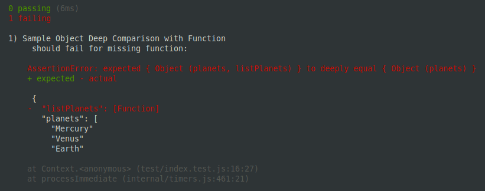
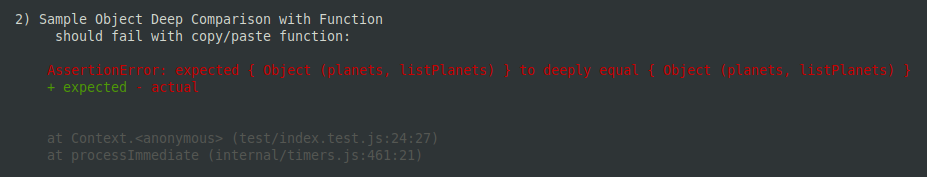
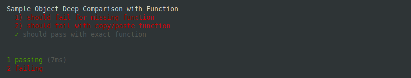
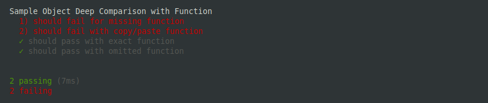
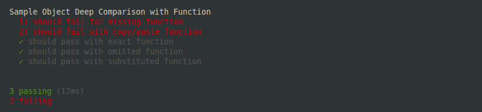

**[⏪ PREV](./5259d907-1870-41d0-8764-fca3eed75c7e.md)** | **[HOME](./index.md)**

> Chapter 6: **JavaScript Tips and Tricks**
>
> [6.0](./5259d907-1870-41d0-8764-fca3eed75c7e.md) |
**6.1**


# Comparing Objects Containing Functions

Setting: Unit testing an object that contains a function
- chai
- mocha
- lodash

Problem: performing deep equal expectation breaks when an object contains a function

## TL;DR

```js
const { isFunction } = require('lodash');

// substitute functions
const parsedObj = JSON.parse(JSON.stringify(obj, (k, v) => isFunction(v) ? 'Function' : v));
// OR omit functions
const parsedObj = JSON.parse(JSON.stringify(obj));
```

## Setup Test Project

Run the following commands in a terminal to setup a temp code directory and npm
project
```bash
mkdir /tmp/code-js-obj-func
cd /tmp/code-js-obj-func

npm init -y
npm i -D chai lodash mocha

mkdir test
touch test/index.test.js
```

Edit the `test/index.test.js` in your choice editor, add the following
```js
const { expect } = require('chai');

describe('Sample Object Deep Comparison with Function', () => {
  const solar = {
    planets: [
      'Mercury', 'Venus', 'Earth', 'Mars',
      'Jupiter', 'Saturn', 'Uranus', 'Neptune',
    ],
    listPlanets() {
      console.log('Planets:');
      this.planets.forEach(planet => console.log(`- ${planet}`));
    },
  };

  it('should fail for missing function', () => {
    expect(solar).to.deep.equal({
      planets: [
        'Mercury', 'Venus', 'Earth', 'Mars',
        'Jupiter', 'Saturn', 'Uranus', 'Neptune',
      ],
    });
  });
});
```

Run the test
```js
npx mocha
```



This failure makes sense... now add another unit test, but this one will
copy/paste the function definition from the original

```js
  it('should fail with copy/paste function', () => {
    expect(solar).to.deep.equal({
      planets: [
        'Mercury', 'Venus', 'Earth', 'Mars',
        'Jupiter', 'Saturn', 'Uranus', 'Neptune',
      ],
      listPlanets() {
        console.log('Planets:');
        this.planets.forEach(planet => console.log(`- ${planet}`));
      },
    });
  });
```

Run tests again
```js
npx mocha
```



Hmm, not very helpful...

Let's set the expected function to the same reference as the original; add
another test

```js
  it('should pass with exact function', () => {
    expect(solar).to.deep.equal({
      planets: [
        'Mercury', 'Venus', 'Earth', 'Mars',
        'Jupiter', 'Saturn', 'Uranus', 'Neptune',
      ],
      listPlanets: solar.listPlanets,
    });
  });
```

Run tests again
```js
npx mocha
```



Okay, so that works, but it might not always we convenient to do this. Let's
establish 2 options
1. omit functions for comparison
2. substitute functions so we can at least validate those function properties
   exist

The `JSON.stringify(obj)` automatically omits properties that are functions!
Add another test

```js
  it('should pass with omitted function', () => {
    const parsedSolar = JSON.parse(JSON.stringify(solar));
    expect(parsedSolar).to.deep.equal({
      planets: [
        'Mercury', 'Venus', 'Earth', 'Mars',
        'Jupiter', 'Saturn', 'Uranus', 'Neptune',
      ],
    });
  });
```

Run tests again
```js
npx mocha
```



Cool, now simply use `JSON.parse(JSON.stringify(obj))` to easily omit function
properties!

This JSON stringify function can also take a
[replacer function](https://developer.mozilla.org/en-US/docs/Web/JavaScript/Reference/Global_Objects/JSON/stringify#the_replacer_parameter)
as it's second parameter. Let's use
[lodash isFunction](https://lodash.com/docs/4.17.15#isFunction) for simplicity; Add another test

```js
  it('should pass with substituted function', () => {
    const { isFunction } = require('lodash');

    const parsedSolar = JSON.parse(
      JSON.stringify(solar, (k, v) => isFunction(v) ? 'Function' : v)
    );
    expect(parsedSolar).to.deep.equal({
      planets: [
        'Mercury', 'Venus', 'Earth', 'Mars',
        'Jupiter', 'Saturn', 'Uranus', 'Neptune',
      ],
      listPlanets: 'Function',
    });
  });
```

Note, in this test, we're substituting the function property with a hard-coded
string `Function` - This allows you to confirm the property `listPlanets` exists

Run tests again
```js
npx mocha
```



## Conclusion

In many cases, for deep-equals on large objects with multi-level-nesting, simply
omitting function props with a simple stringify-then-parse can suffice, but
sometimes you want to validate that those function props exist; but you might
not want to make separate expect-statements for each one - especially if there
are many, and/or nested deeply.

The other scenario is you might want to log/save an object in full, so the
replacer function on the stringify can allow you to retain the
non-standard-JSON property names.


---

**[⏪ PREV](./5259d907-1870-41d0-8764-fca3eed75c7e.md)** | **[HOME](./index.md)**

