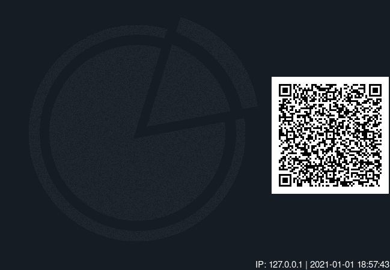
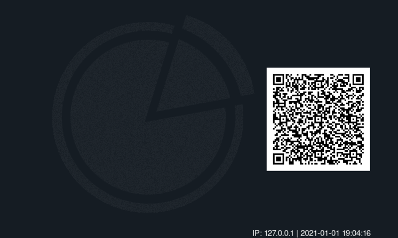

**[⏪ PREV](./961f3153-0cf6-4da1-a75b-ab3679170a33.md)** | **[HOME](./index.md)** | **[NEXT ⏩](./132c8852-2584-4e6b-a68b-7d5674d598f1.md)**

> Chapter 4: **Raspberry Pi Commander**
>
> [4.0](./86387b1c-246b-4646-8cdc-8d2d08149523.md) |
[4.1](./961f3153-0cf6-4da1-a75b-ab3679170a33.md) |
**4.2**


# Wallpaper with QR Code

Given:
- Needs
  - A way to generate a QR code for a given url
    - Install dependencies if not installed
  - A way to get current IP address
- Selected dependencies
  - [qrencode](https://linux.die.net/man/1/qrencode)

Then:
- Start scripting in `bash/wallpaper/update.sh`

## Phase 1
---
### Create QR Code from IP

From the previous section, your `bash/wallpaper/update.sh` should look like:

```bash
#!/bin/bash
THIS_DIR="$( cd "$( dirname "${BASH_SOURCE[0]}" )" && pwd )"
source $THIS_DIR/../utils.sh

function main() {
  echo "Setting wallpaper..."
}

runMain "$@"
```

**Install Dependencies**

Now we need a way to install dependencies (apt packages) IF they are not
installed. This is what I found to work best for determining if (not) installed:

```bash
function notInstalled() {
  local status="$(dpkg-query -W -f='${db:Status-Status}' $1 2> /dev/null)"
  echo "running notInstalled on $1; status: $status"
  test -z "$status" || test "$status" != "installed"
}
```

We will most likely want this function accessible to other scripts, so put it in
the `bash/utils.sh` file.

Now let's use it in `bash/wallpaper/update.sh`, add it to the main function

```bash
  if notInstalled qrencode; then
    echo "Installing qrencode..."
    sudo apt-get install -y qrencode
  fi
```

Cool. Now, when running the wallpaper update script, it will install qrencode
package if it's not installed already, otherwise, it skips the install.

**Create QR Code from IP Address**

Add the following to the main function, after the dependency install, of the
wallpaper update script

```bash
  local ip="$(ip route get 1 | head -1 | cut -d' ' -f7)"
  echo "ip: $ip"
  qrencode -s 6 -l H -o "$THIS_DIR/qrcode.png" "http://$ip:3000"
```

This gets the IP address and creates a file, `qrcode.png`, in the wallpaper
directory. The port number is for later, when we serve up a node server/app.

One last thing for this phase, we want git to ignore the `qrcode.png` file since
it's generated. Add a file: `bash/wallpaper/.gitignore`; This is intentionally
in the wallpaper directory, to be scoped to this directory. Later, we'll use the
similar pattern for ignoring other scripts' generated things.


```.gitignore
# bash/wallpaper/.gitignore
qrcode.png
```

[**Phase 1 complete!**](https://github.com/tveal/template-pi-commander/compare/v0.0-getting-started...v0.1-wallpaper-p1)
Now if you run `bash/wallpaper/update.sh`, you should get a `qrcode.png` file
generated in the wallpaper directory.

## Phase 2
---
### Set Wallpaper on Raspberry Pi

Scope
- Abstract logic from the main function
- Add check for _isRaspberryPi_
- Conditionally set wallpaper on Pi

Up to this point, your `bash/wallpaper/update.sh` should look like this:
```bash
#!/bin/bash
THIS_DIR="$( cd "$( dirname "${BASH_SOURCE[0]}" )" && pwd )"
source $THIS_DIR/../utils.sh

function main() {
  echo "Setting wallpaper..."

  if notInstalled qrencode; then
    echo "Installing qrencode..."
    sudo apt-get install -y qrencode
  fi

  local ip="$(ip route get 1 | head -1 | cut -d' ' -f7)"
  echo "ip: $ip"
  qrencode -s 6 -l H -o "$THIS_DIR/qrcode.png" "http://$ip:3000"
}

runMain "$@"
```

**Abstract logic from the main function**

We can remove that initial echo line, `echo "Setting wallpaper..."`, and then
create two new functions below main, **moving** the code out of main into their
respective functions

The first new function: `installDependencies`

```bash
function installDependencies() {
  if notInstalled qrencode; then
    echo "Installing qrencode..."
    sudo apt-get install -y qrencode
  fi
}
```

The second new function: `createWallpaper`

```bash
function createWallpaper() {
  local ip="$(ip route get 1 | head -1 | cut -d' ' -f7)"
  echo "ip: $ip"
  qrencode -s 6 -l H -o "$THIS_DIR/qrcode.png" "http://$ip:3000"
}
```

Make sure to call these new functions from main now

```bash
function main() {
  installDependencies
  createWallpaper
}
```

**Add check for _isRaspberryPi_**

Now jump over to the file `bash/utils.sh` and add the function

```bash
function isRaspberryPi() {
  test "$(hostname)" = "raspberrypi"
}
```

We'll need this function in multiple scripts to conditionally do things only
when on the Raspberry Pi

**Conditionally set wallpaper on Pi**

Back in the file `bash/wallpaper/update.sh`, add these statements to the main function:

```bash
  if isRaspberryPi; then
    # https://stackoverflow.com/a/46259031
    export XAUTHORITY=/home/pi/.Xauthority
    export XDG_RUNTIME_DIR=/run/user/1000
    pcmanfm -d -w "$THIS_DIR/qrcode.png" --wallpaper-mode fit --display :0
  fi
```

[**Phase 2 complete!**](https://github.com/tveal/template-pi-commander/compare/v0.1-wallpaper-p1...v0.2-wallpaper-p2)
Now your wallpaper update script should set the Raspberry Pi's wallpaper to the
generated QR code.

## Phase 3
---
### Add Text and Style to Wallpaper

Scope
- Combine QR code image with a logo image
- Add IP and timestamp text
- Resize and fill image to 7" Pi screen

**Combine QR code image with a logo image**

First, we need to install a new dependency that will allow us to change images
from command-line, imagemagick. Add the following to the `installDependencies`
function

```bash
  if notInstalled imagemagick; then
    echo "Installing imagemagick..."
    sudo apt-get install -y imagemagick
  fi
```

Second, add the following to the `createWallpaper` function

```bash
  # combine Pi-CMD-logo with qrcode
  montage "$THIS_DIR/Pi-CMD-logo.png" "$THIS_DIR/qrcode.png" -background '#151c23' -geometry +2+2 "$THIS_DIR/wallpaper.png"
```

Third, create/copy a logo image, such as [Pi-CMD-logo.png](../img/Pi-CMD-logo.png) to the `bash/wallpaper` directory.

Finally, update the `bash/wallpaper/.gitignore` file to exclude `wallpaper.png`

```.gitignore
# bash/wallpaper/.gitignore
qrcode.png
wallpaper.png
```

If everything went well, the script this far should create a `wallpaper.png` file that looks something like this:


**Add IP and timestamp text**

Now add another set of statements to the `createWallpaper` function

```bash
  # add ip and timestamp to wallpaper
  convert \
    "$THIS_DIR/wallpaper.png" \
    -gravity SouthEast \
    -pointsize 15 \
    -fill '#fff' \
    -annotate 0 "IP: $ip | $(date '+%Y-%m-%d %T')" \
    "$THIS_DIR/wallpaper.png"
```

Running the wallpaper update script again should now include the IP and timestamp (should show a real address, not `127.0.0.1` in this sample)



**Resize and fill image to 7" Pi screen**

Add another convert transformation in the `createWallpaper` function

```bash
  # resize and fill to 7" touchscreen
  convert \
    "$THIS_DIR/wallpaper.png" \
    -resize 800x480 \
    -background '#151c23' \
    -gravity center \
    -extent 800x480 \
    "$THIS_DIR/wallpaper.png"
```

One last thing: back in the `main` function, where we tell the Raspberry Pi to
set the wallpaper, change the filename from `qrcode.png` to `wallpaper.png`

FROM
```bash
pcmanfm -d -w "$THIS_DIR/qrcode.png" --wallpaper-mode fit --display :0
```
TO
```bash
pcmanfm -d -w "$THIS_DIR/wallpaper.png" --wallpaper-mode fit --display :0
```

At last, running the wallpaper update script should create a `wallpaper.png` with
- logo and QA code
- text with IP and timestamp
- resized for 7" Pi Touchscreen



[**Phase 3 complete!**](https://github.com/tveal/template-pi-commander/compare/v0.2-wallpaper-p2...v0.3-wallpaper-p3)


---

**[⏪ PREV](./961f3153-0cf6-4da1-a75b-ab3679170a33.md)** | **[HOME](./index.md)** | **[NEXT ⏩](./132c8852-2584-4e6b-a68b-7d5674d598f1.md)**

