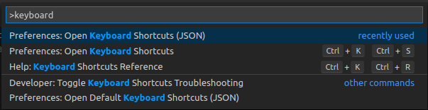
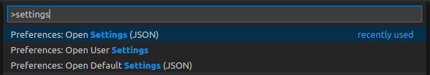

4360112c-f735-4dac-8f06-e8386bcd1ffd
# Install VSCode

Follow the setup appropriate for your system
- https://code.visualstudio.com (Microsoft branded version)
- https://vscodium.com/ (Open Source version)

## Configuration

**Keyboard Shortcuts**

1. Do a command search (Ctrl + Shift + P) for "keyboard" and open the JSON
   preferences

    

    You could use the non-JSON GUI, but using the JSON version, you can
    copy/paste config previously saved/scripted

2. Copy/Paste or modify the config as desired and save

    ```json
    // Place your key bindings in this file to overwrite the defaults
    [
        {
            "key": "alt+meta+down",
            "command": "editor.action.copyLinesDownAction",
            "when": "editorTextFocus && !editorReadonly"
        },
        {
            "key": "ctrl+shift+alt+down",
            "command": "-editor.action.copyLinesDownAction",
            "when": "editorTextFocus && !editorReadonly"
        },
        {
            "key": "alt+meta+up",
            "command": "editor.action.copyLinesUpAction",
            "when": "editorTextFocus && !editorReadonly"
        },
        {
            "key": "ctrl+shift+alt+up",
            "command": "-editor.action.copyLinesUpAction",
            "when": "editorTextFocus && !editorReadonly"
        },
        {
            "key": "ctrl+d",
            "command": "editor.action.deleteLines",
            "when": "editorTextFocus && !editorReadonly"
        },
        {
            "key": "ctrl+shift+k",
            "command": "-editor.action.deleteLines",
            "when": "editorTextFocus && !editorReadonly"
        },
        {
            "key": "ctrl+e",
            "command": "workbench.files.action.showActiveFileInExplorer"
        }
    ]
    ```

**Settings**

1. Do a command search (Ctrl + Shift + P) for "settings" and open the JSON
   settings

    

2. Copy/Paste or modify the config as desired and save

    ```json
    {
        "files.autoSave": "afterDelay",
        "explorer.autoReveal": false,
        "workbench.editor.enablePreview": false,
        "window.zoomLevel": 0,
        "editor.renderWhitespace": "all",
        "javascript.updateImportsOnFileMove.enabled": "always",
        "terminal.integrated.shell.linux": "/bin/bash",
        "diffEditor.ignoreTrimWhitespace": false,
        "editor.tabSize": 2,
        "editor.hover.enabled": false
    }
    ```

**Some Extensions**

- [Code Spell Checker](https://marketplace.visualstudio.com/items?itemName=streetsidesoftware.code-spell-checker)
- [Escape regular expression](https://marketplace.visualstudio.com/items?itemName=kirbydigital.escape-regexp)*
- [GitLens — Git supercharged](https://marketplace.visualstudio.com/items?itemName=eamodio.gitlens)
- [Reflow Markdown](https://marketplace.visualstudio.com/items?itemName=marvhen.reflow-markdown)*
- [Time Converter](https://marketplace.visualstudio.com/items?itemName=HaaLeo.timing)
- [vscode-base64](https://marketplace.visualstudio.com/items?itemName=adamhartford.vscode-base64)*
- [XML Tools](https://marketplace.visualstudio.com/items?itemName=DotJoshJohnson.xml)
- [Draw.io Integration](https://marketplace.visualstudio.com/items?itemName=hediet.vscode-drawio)*

*only on vscode, not vscodium
