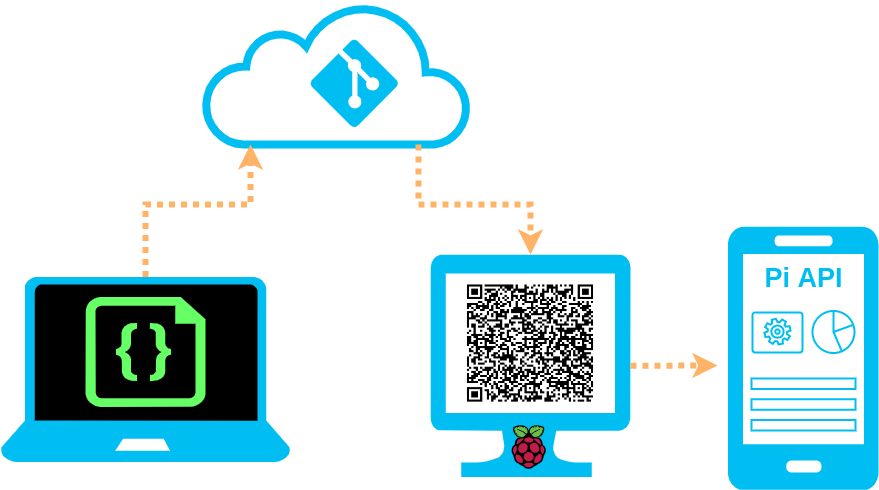

86387b1c-246b-4646-8cdc-8d2d08149523
# Pi Commander Vision

**The Goal**
- Raspberry Pi with an API/WebApp to do cool things
- A way to collaborate Pi config remotely
- Account for dynamic IP address for API/WebApp


## High Level Vision



**The Approach**
- Use a git repository on a remote server to manage the code that configures the
  Pi
- Setup crontab(s) on the Pi to periodically pull latest config and run
  idempotent update scripts
- Host an API/WebApp on the Pi for mobile devices to connect to

## Diving Deeper

**From the End User Perspective**
- Provide a simple way to connect a phone/tablet to the Raspberry Pi's
  API/WebApp
    - Utilize a Raspberry Pi touchscreen to display a QR code containing the
      Pi's API/WebApp url
    - Automate QR code updates given the IP can change
    - Provide a shortcut/app to manually refresh the QR code should the
      automatic timing not suffice
- Address auth considerations; With the ease of discovery...
    - Can anyone connect?
    - Can anyone who connects access all the features?

**From the Pi Perspective**
- Provide consistent, collaborative way to configure, update, and manage without
  on-site access
    - All configuration as code!
    - Idempotency; design scripts to run n-times and only update things that
      change
    - Host code on a remote server, periodically poll for changes and rerun
        - crontab
- Control access to this configuration
    - private
    - SSH public/private key pair

**From the Maintainer Perspective**
- Modular config, expandable, support diverse solutions
    - bash as entry point, native for Raspberry Pi OS
    - Node/JavaScript for API/WebApp
    - other package/tool/lang provisioning needed
    - Standalone design to test in VM's
- Control how code changes
    - review and approval controls
    - code conventions
    - tests/quality control

## Learning the Needful

[Official Raspberry Pi Documentation](https://www.raspberrypi.org/documentation/)

**Hardware Resources**
- [Smarti Pi Touch 2 Setup](https://smarticase.com/pages/smartipi-touch-2-setup-1)

**Software Resources**
- [Get Raspberry Pi OS](https://www.raspberrypi.org/software/)
- [SSH setup](https://www.raspberrypi.org/documentation/remote-access/ssh/)
- [Setup crontab file](https://corenominal.org/2016/05/12/howto-setup-a-crontab-file/)
  - [Official Pi doc for crontab](https://www.raspberrypi.org/documentation/linux/usage/cron.md)
  - [Crontab Guru](https://crontab.guru/#*/5_*_*_*_*)
- QR code gen: [qrencode how-to](https://www.cloudsavvyit.com/8382/how-to-create-qr-codes-from-the-linux-command-line/)
  - [Linux man page](https://linux.die.net/man/1/qrencode)
- [How to change desktop appearance on Raspberry Pi](https://raspberrytips.com/pimp-my-raspberry-pi/)
- Node server
  - [How to create an http server](https://nodejs.org/en/docs/guides/getting-started-guide/)
  - [How to create an https server](https://nodejs.org/en/knowledge/HTTP/servers/how-to-create-a-HTTPS-server/)
  - PM2: [home](https://pm2.keymetrics.io/) |
    [npm](https://www.npmjs.com/package/pm2)
    - [Quick start](https://pm2.keymetrics.io/docs/usage/quick-start/)
    - [Ecosystem file](https://pm2.keymetrics.io/docs/usage/application-declaration/)
    - [Startup script generator](https://pm2.keymetrics.io/docs/usage/startup/)
- [React + Express (NOT create-react-app!)](https://medium.com/front-end-weekly/server-side-rendering-with-react-and-express-382591bfc77c)
  - [Node Basic Auth Structure](https://jasonwatmore.com/post/2018/09/24/nodejs-basic-authentication-tutorial-with-example-api#projectstructure)
  - [express routing](https://expressjs.com/en/guide/routing.html)

**Troubleshooting Resources**
- [Cannot open display through SSH](https://raspberrypi.stackexchange.com/a/68581)

## Pi Config Tidbits

**Setting the background from CLI**

```bash
pcmanfm --set-wallpaper /usr/share/rpd-wallpaper/mountain.jpg
```

If you get and error such as (when over SSH):
```
Cannot open display:
```

then run the following then try again:
```bash
export DISPLAY=:0.0
```
